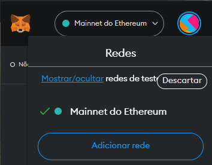
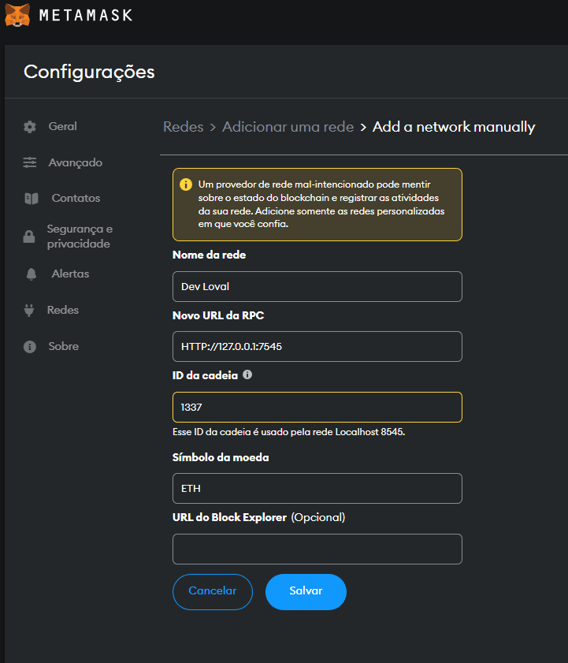
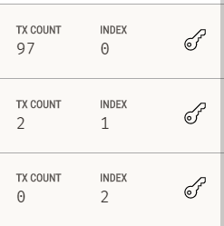
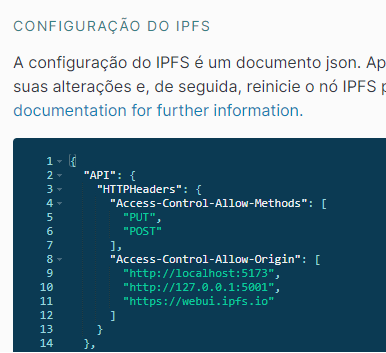

### Ambiente

* [Ganache](https://trufflesuite.com/ganache/)
* [IPFS](https://docs.ipfs.tech/install/ipfs-desktop/)
* [Metamask](https://metamask.io/download/)

### Como rodar localmente
- Rode os comandos ```npm install``` e, em seguida, ```vite dev``` na raiz do projeto
  A aplicação irá subir por padrão na porta 5173.
  <br/>
  Alternativamente, rode ```npm run build``` e dê pin na pasta dist em seu nó ipfs. Você poderá então acessar a aplicação digitando o cid correspondente pelo navegador.
  
> **💡** No navegador [Brave](https://brave.com/ipfs-support/), você pode acessar um conteúdo no IPFS digitando ipfs://[CID] na barra de endereço.

- [Instale a extensão Metamask no navegador](https://metamask.io/download/)
- [Instale o Ganache e crie um workspace](https://trufflesuite.com/docs/ganache/quickstart/)
- [Instale o IPFS Desktop](https://docs.ipfs.tech/install/ipfs-desktop/) ou use o nó IPFS do Brave
- Conecte a Metamask à sua blockchain local: <br/>
Clique no ícone da extensão -> dropdown centralizado no topo com nome da rede atual -> Adicionar rede -> Add a network manually <br/>
Preencha os dados conforme a url do RPC server indicado no Ganache, e 1337 em "ID da cadeia":
<br/>
<table>
  <tr>
    <td>
      
    </td>
    <td>
      
    </td>
  </tr>
</table>


- Conecte sua carteira Metamask a um dos endereços gerados no Ganache. Para isso, clique no avatar no canto superior direito da extensão Metamask, e em seguida em Importar Conta. Será solicitada uma chave privada. Para obtê-la, no Ganache, clique em um dos ícones de chave que localizado ao lado de cada endereço e copie a chave privada.



- Para publicar conteúdos usando seu nó local IPFS, você deve liberar os métodos PUT e POST nas configurações



- Na aplicação, nas rotas /admin ou /deploy, clique no botão IPFS e configure o endereço apropriado para o seu nó.


### Principais dependências

* https://www.npmjs.com/package/ipfs-http-client
* https://www.npmjs.com/package/ethers

